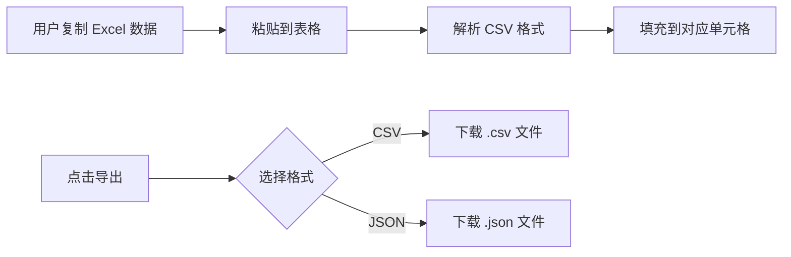

# SnapSheet - 产品需求文档（PRD）

## 1. 产品概述

SnapSheet 是一款基于 Web 的高性能电子表格应用，定位为轻量级 Excel 替代品。产品在 72 小时 MVP 周期内聚焦核心表格计算与数据交互能力，让用户无需安装 Office 即可在浏览器中完成数据录入、公式计算、数据分析与导入导出操作。

- **目标用户**：轻度办公用户、开发者、学生及需要快速记录与计算数据的场景
- **核心价值**：打开即用、公式实时计算、支持 CSV/JSON 导入导出、AI 辅助分析

## 2. 核心功能

### 2.1 功能优先级划分

| 优先级 | 类型 | 功能范围 |
|--------|------|----------|
| P0 | 必须实现 | 基础表格渲染、公式计算引擎、数据导入导出 |
| P1 | 加分项 | AI 辅助功能、基础格式设置、多工作表管理 |
| P2 | 明确排除 | VBA/宏、完整 Excel 函数库、百万行数据处理、.xlsx 全格式兼容 |

### 2.2 功能模块

1. **表格渲染引擎**：基于 Canvas 实现高性能网格渲染，支持双向滚动、单元格选中与编辑
2. **公式计算引擎**：支持 SUM/AVG/MAX/MIN 及单元格引用，实现依赖追踪与自动重算
3. **数据导入导出**：支持 CSV 与 JSON 格式导入导出，兼容从 Excel 复制粘贴的数据
4. **AI 辅助分析**（P1）：区域趋势总结、图表建议、自然语言生成公式
5. **格式设置**（P1）：加粗、左/右对齐、拖拽调整列宽
6. **多工作表管理**（P1）：底部 Sheet 标签切换与新建

### 2.3 页面详情

| 页面名称 | 模块名称 | 功能描述 |
|----------|----------|----------|
| 主界面 | 顶部工具栏 | 文件操作（导入/导出/新建）、格式设置按钮、AI 助手入口 |
| 主界面 | 公式栏 | 显示/编辑当前选中单元格的公式或值 |
| 主界面 | 表格区域 | Canvas 渲染的网格，支持滚动、选中、编辑、公式计算 |
| 主界面 | 底部 Sheet 栏 | 工作表标签切换、新建 Sheet 按钮 |
| 主界面 | AI 侧边栏 | 选中区域后显示 AI 分析与建议（P1） |

## 3. 核心流程

### 3.1 用户主流程

用户打开 SnapSheet → 看到空白表格 → 单击单元格选中 → 直接输入数据或双击进入编辑 → 在公式栏输入公式（如 =SUM(A1:A5)）→ 按回车确认 → 公式自动计算并显示结果 → 修改源单元格数据 → 引用该单元格的所有公式自动更新 → 导出为 CSV 或 JSON 保存。

### 3.2 公式计算流程

```mermaid
flowchart TD
    A[用户输入公式 =SUM(A1:A5)] --> B[解析公式为 AST]
    B --> C[提取依赖单元格 A1,A2,A3,A4,A5]
    C --> D[构建依赖图]
    D --> E[计算各单元格值]
    E --> F[返回计算结果]
    F --> G[显示在单元格中]
    H[修改 A3 的值] --> I[触发依赖更新]
    I --> J[重新计算依赖 A3 的公式]
    J --> G
```

### 3.3 数据导入导出流程



## 4. 用户界面设计

### 4.1 设计风格

- **整体风格**：现代、专业、极简办公风格，参考 Notion + Excel Online 的混合体验
- **主色调**：
  - 背景色：#FFFFFF（纯白）
  - 主色：#1a73e8（蓝色，用于选中状态与主按钮）
  - 次色：#f1f3f4（灰色，用于表头与边框）
  - 强调色：#34a853（绿色，用于成功状态与 AI 建议）
- **字体**：
  - 英文/数字：JetBrains Mono（等宽字体，便于数据对齐）
  - 中文：系统默认无衬线字体（PingFang SC / Microsoft YaHei）
- **布局**：顶部固定工具栏 + 公式栏，中间表格区域自适应，底部 Sheet 标签栏
- **边框与阴影**：
  - 单元格边框：1px solid #e0e0e0
  - 选中单元格：2px solid #1a73e8，带轻微外发光
  - 表头背景：#f8f9fa，字体加粗

### 4.2 页面设计概述

| 页面 | 模块 | UI 元素 |
|------|------|---------|
| 主界面 | 工具栏 | 高度 48px，白色背景，底部 1px 边框，包含文件菜单、格式按钮、AI 入口 |
| 主界面 | 公式栏 | 高度 36px，左侧显示当前单元格地址（如 A1），右侧为公式输入框 |
| 主界面 | 表格区域 | Canvas 占据剩余空间，行号列宽 50px，列标题行高 28px，数据单元格默认 100px×24px |
| 主界面 | Sheet 栏 | 高度 32px，底部固定，标签页样式，当前 Sheet 底部带蓝色指示条 |
| 主界面 | AI 侧边栏 | 宽度 280px，右侧滑出，显示选中区域的数据分析与建议 |

### 4.3 响应式设计

- **桌面优先**：针对 1280px 以上屏幕优化
- **自适应规则**：表格区域随窗口大小自适应，最小支持 1024×768
- **滚动优化**：Canvas 虚拟滚动，仅渲染可视区域内单元格，确保千行级数据流畅

### 4.4 交互动效

- **单元格选中**：即时响应，蓝色边框无动画
- **编辑模式**：单元格背景变为白色，显示闪烁光标，按 Enter/Tab/Esc 退出
- **列宽拖拽**：鼠标变为 col-resize，拖拽时显示虚线指示新宽度
- **AI 侧边栏**：从右侧平滑滑入（300ms ease-out）
- **公式计算**：计算结果即时更新，无闪烁
