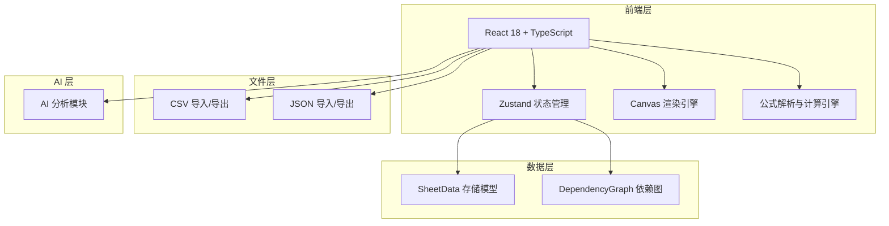

# SnapSheet - 技术架构文档

## 1. 架构设计



## 2. 技术描述

- **前端框架**：React 18 + TypeScript
- **构建工具**：Vite 5
- **样式方案**：Tailwind CSS 3
- **状态管理**：Zustand（轻量级，适合表格这类高频更新场景）
- **渲染方案**：HTML5 Canvas 2D（自定义渲染引擎，虚拟滚动，性能优于 DOM）
- **公式引擎**：自研递归下降解析器，无外部依赖
- **AI 集成**：前端直接调用大模型 API（如 OpenAI / 通义千问）
- **无后端**：纯前端实现，数据存储于内存与浏览器本地

## 3. 路由定义

| 路由 | 用途 |
|------|------|
| / | 主应用界面（表格编辑器） |

单页应用，无多路由需求，所有功能集成于同一界面。

## 4. 核心模块设计

### 4.1 Canvas 渲染引擎

```
CanvasRenderer
├── Viewport（视口管理：偏移量、缩放比例）
├── GridPainter（网格绘制：单元格背景、边框、文字）
├── CellMeasurer（单元格测量：文字宽度、自动换行）
└── ScrollManager（滚动管理：同步行/列滚动条）
```

### 4.2 公式计算引擎

```
FormulaEngine
├── Lexer（词法分析：将公式字符串转为 Token 序列）
├── Parser（语法分析：生成 AST）
├── Evaluator（求值器：遍历 AST 计算结果）
├── DependencyGraph（依赖图：追踪单元格引用关系）
└── Recalculator（重算器：数据变更时拓扑排序更新）
```

支持语法：
- 单元格引用：`A1`, `B2`
- 区域引用：`A1:A5`, `B1:D3`
- 函数调用：`SUM(A1:A5)`, `AVG(A1:A5)`, `MAX(A1:A5)`, `MIN(A1:A5)`
- 二元运算：`=A1+B2`, `=A1*B2`

### 4.3 数据模型

```typescript
interface Cell {
  value: string;           // 原始输入值
  computed?: number | string; // 计算后的值（公式单元格）
  formula?: string;        // 公式表达式（如 "=SUM(A1:A5)"）
  style?: CellStyle;       // 单元格样式
}

interface CellStyle {
  bold?: boolean;
  align?: 'left' | 'center' | 'right';
  width?: number;          // 列宽（存储于列定义中）
}

interface Sheet {
  id: string;
  name: string;
  cells: Map<string, Cell>; // key: "A1", "B2" 等
  colWidths: Map<number, number>; // key: 列索引, value: 像素宽度
  rowHeights: Map<number, number>;
}

interface Workbook {
  sheets: Sheet[];
  activeSheetId: string;
}
```

## 5. 性能设计

- **虚拟滚动**：仅渲染可视区域内单元格，滚动时动态更新
- **脏矩形渲染**：只重绘发生变化的单元格区域
- **依赖图增量更新**：公式重算时通过拓扑排序仅更新受影响单元格
- **千行级目标**：1000 行 × 100 列数据下滚动与编辑保持 60fps

## 6. 文件格式规范

### 6.1 CSV 格式
- RFC 4180 标准
- 支持逗号分隔与引号包裹
- 编码：UTF-8 with BOM（兼容 Excel）

### 6.2 JSON 格式
```json
{
  "version": "1.0",
  "sheets": [
    {
      "name": "Sheet1",
      "cells": {
        "A1": { "value": "100", "formula": null },
        "A2": { "value": "=SUM(A1:A5)", "formula": "=SUM(A1:A5)" }
      },
      "colWidths": { "0": 120, "1": 80 }
    }
  ]
}
```

## 7. 目录结构

```
src/
├── components/
│   ├── Toolbar.tsx           # 顶部工具栏
│   ├── FormulaBar.tsx        # 公式栏
│   ├── SheetTabs.tsx         # 底部 Sheet 标签
│   ├── AISidebar.tsx         # AI 侧边栏（P1）
│   └── Spreadsheet.tsx       # 主表格组件（Canvas 容器）
├── canvas/
│   ├── CanvasRenderer.ts     # Canvas 渲染主类
│   ├── GridPainter.ts        # 网格绘制
│   └── ScrollManager.ts      # 滚动管理
├── engine/
│   ├── Lexer.ts              # 词法分析器
│   ├── Parser.ts             # 语法分析器
│   ├── Evaluator.ts          # 表达式求值
│   ├── DependencyGraph.ts    # 依赖图管理
│   └── FormulaEngine.ts      # 公式引擎门面类
├── store/
│   └── useSpreadsheetStore.ts # Zustand 状态管理
├── utils/
│   ├── csv.ts                # CSV 导入导出
│   ├── json.ts               # JSON 导入导出
│   ├── cellRef.ts            # 单元格引用转换（A1 ↔ 行列索引）
│   └── constants.ts          # 常量定义（默认列宽、行高等）
├── types/
│   └── index.ts              # TypeScript 类型定义
├── App.tsx
└── main.tsx
```
