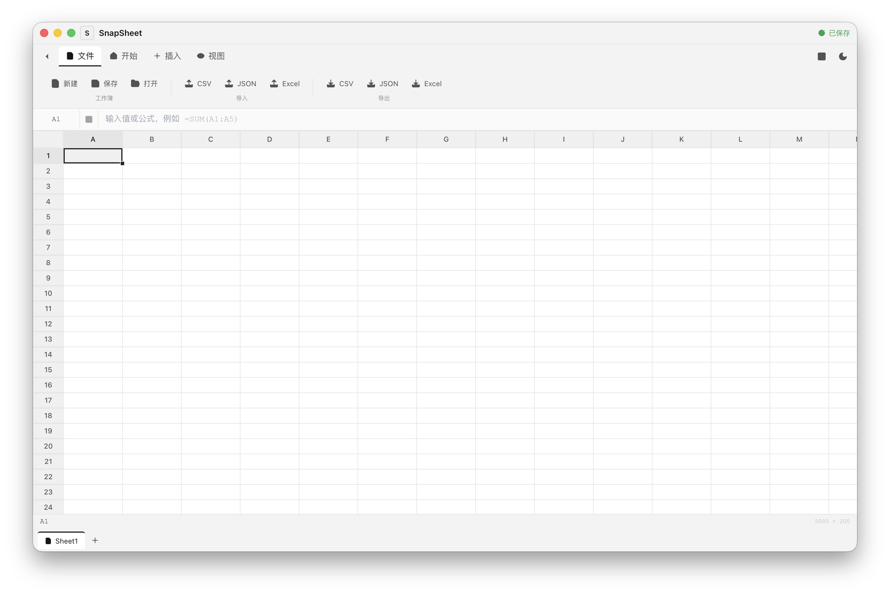

# SnapSheet


一个现代化的电子表格应用，基于 React + TypeScript + Canvas 构建，支持公式计算、多工作表、AI 数据分析、SnapLang 脚本以及本地桌面客户端。

## 🖼️ 预览



## ✨ 功能特性

### 核心功能
- 📊 **电子表格**：完整的表格编辑功能，支持 1000 行 × 100 列
- 📝 **公式计算**：支持 260+ 种公式函数，自动依赖追踪和缓存优化
- 📄 **多工作表**：创建、切换、删除多个工作表，支持工作表重命名
- 🎨 **单元格样式**：支持加粗、对齐、边框、背景色、数字格式等样式设置
- 📥 **导入导出**：支持 Excel、CSV 和 JSON 格式的导入导出
- 💾 **本地保存**：自动保存到浏览器本地存储，支持手动保存和打开
- 🔄 **撤销/重做**：支持多次撤销/重做操作，基于操作历史栈实现

### 数据处理
- 🔍 **查找替换**：支持在表格中查找和替换内容，支持正则匹配
- 📐 **列宽行高调整**：拖拽调整列宽和行高，双击自动适配内容宽度
- 🗂️ **排序**：支持单列升序/降序排序
- 🎯 **数据验证**：支持数值范围验证、下拉列表等数据验证规则
- 🎨 **条件格式**：支持基于条件的单元格高亮显示

### 脚本与 AI
- 🤖 **AI 数据分析**：选中区域自动分析统计数据（求和、平均值、最大值、最小值等）
- ✨ **公式生成**：通过自然语言描述自动生成公式（如"求和"、"平均值"）
- ⚡ **SnapLang 脚本**：自定义脚本语言，支持变量、函数、循环与表格操作

### 视图功能
- 🔒 **冻结窗格**：支持冻结首行、首列或两者同时冻结
- 📱 **响应式布局**：顶部 Ribbon 支持折叠/展开，右侧属性面板可伸缩
- 🌓 **主题切换**：支持浅色/深色主题切换

### 桌面客户端
- 🖥️ **Electron 桌面版**：支持 macOS（Apple Silicon / Intel），可离线运行
- 🌐 **官方网站**：`website/` 目录包含产品官网，支持在线试用与下载

## 🚀 快速开始

### 安装依赖

```bash
npm install
```

### Web 开发模式

```bash
npm run dev
```

启动后访问 http://localhost:5173

### 桌面端开发模式

```bash
npm run dev:electron
```

### 构建生产版本

```bash
# Web 版本
npm run build

# Electron 桌面客户端（生成 DMG 安装包）
npm run build:electron
```

### 预览生产版本

```bash
npm run preview
```

### 代码检查与测试

```bash
# ESLint 检查
npm run lint

# TypeScript 类型检查
npm run check

# 运行测试
npm test
```

## 📖 使用说明

### 快捷键

| 快捷键 | 功能 |
|--------|------|
| `Ctrl/Cmd + C` | 复制 |
| `Ctrl/Cmd + V` | 粘贴 |
| `Ctrl/Cmd + X` | 剪切 |
| `Ctrl/Cmd + Z` | 撤销 |
| `Ctrl/Cmd + Y` | 重做 |
| `Ctrl/Cmd + F` | 查找替换 |
| `Ctrl/Cmd + B` | 加粗 |
| `Ctrl/Cmd + S` | 保存工作簿 |
| `Ctrl/Cmd + N` | 新建工作簿 |
| `Enter / F2` | 编辑单元格 |
| `Arrow Keys` | 移动选择 |
| `Delete / Backspace` | 删除单元格内容 |

### 公式使用

在单元格中输入 `=` 开始公式：

```
=SUM(A1:B10)      # 求和
=AVERAGE(C1:C5)   # 平均值
=MAX(D1:D20)      # 最大值
=MIN(E1:E20)      # 最小值
=COUNT(F1:F10)    # 计数
=IF(A1>10, "大", "小")   # 条件判断
=CONCAT(A1, B1)   # 字符串连接
=TODAY()          # 当前日期
=NOW()            # 当前时间
=ROUND(G1, 2)     # 四舍五入保留两位小数
=ABS(H1)          # 绝对值
```

### 工程领域专业公式

SnapSheet 内置 `engineeringFormulas.ts` 工程公式库，涵盖机械、电气、土木、材料与热力学/流体力学四大领域，共 115 个常用公式。

#### 机械工程

```
=FORCE(10, 9.8)                 # 力 F = m·a，返回 98 N
=TORQUE(50, 0.2)                # 扭矩 T = F·r，返回 10 N·m
=STRESS(1000, 0.01)             # 正应力 σ = F/A，返回 100000 Pa
=YOUNGS_MODULUS(200e6, 0.001)   # 杨氏模量 E = σ/ε，返回 200 GPa
=CENTRIPETAL_FORCE(2, 10, 0.5)  # 向心力 Fc = m·v²/r，返回 400 N
=EFFICIENCY(800, 1000)          # 效率 η = Pout/Pin×100%，返回 80%
```

#### 电气工程

```
=OHM_V(2, 10)                   # 电压 V = I·R，返回 20 V
=POWER_ELECTRIC(220, 5)         # 电功率 P = V·I，返回 1100 W
=RESISTORS_PARALLEL(100, 100)   # 并联电阻，返回 50 Ω
=RESONANT_FREQ(0.001, 1e-6)     # LC 谐振频率，返回 5032.9 Hz
=VOLTAGE_DIVIDER(12, 2000, 1000) # 分压器输出，返回 4 V
=DECIBEL_POWER(10, 1)           # 功率分贝，返回 10 dB
```

#### 土木工程

```
=BEAM_MOMENT_CENTRAL(1000, 4)   # 简支梁中点弯矩，返回 1000 N·m
=BEAM_DEFLECTION_CENTRAL(1000, 4, 200e9, 8.33e-6)  # 中点挠度
=COLUMN_BUCKLING(200e9, 8.33e-6, 3)  # 欧拉临界荷载
=MANNING_FLOW(0.015, 2, 0.5, 0.001)  # 曼宁流量，返回约 1.88 m³/s
=REYNOLDS_NUMBER(1000, 1, 0.1, 0.001) # 雷诺数，返回 100000
=WIND_PRESSURE(30)              # 基本风压，返回 551.25 Pa
```

#### 材料、热力学与流体力学

```
=DENSITY(50, 0.02)              # 密度 ρ = m/V，返回 2500 kg/m³
=HEAT_CAPACITY(2, 4186, 10)     # 热量 Q = m·c·ΔT，返回 83720 J
=IDEAL_GAS_PRESSURE(1, 300, 0.0224)  # 理想气体压力，返回约 111339 Pa
=CARNOT_EFFICIENCY(300, 600)    # 卡诺效率，返回 0.5
=BERNOULLI_PRESSURE(100000, 2, 4, 1000)  # 伯努利压力，返回 94000 Pa
=STRESS_INTENSITY(50e6, 0.005)  # 应力强度因子，返回约 6.27e6 Pa·√m
```

### 工程实际案例

#### 案例 1：齿轮传动系统转速计算

已知主动轮齿数 20，从动轮齿数 60，主动轮转速 1500 rpm：

```
=GEAR_RATIO(20, 60)             # 传动比 i = 3
=1500 / 3                       # 从动轮转速 = 500 rpm
```

#### 案例 2：简支钢梁挠度校核

跨度 4 m 的简支钢梁，中点承受 10 kN 集中荷载，E = 200 GPa，I = 8.33×10⁻⁶ m⁴：

```
=BEAM_DEFLECTION_CENTRAL(10000, 4, 200e9, 8.33e-6)  # 返回约 0.008 m
```

若允许挠度为 L/250 = 0.016 m，则实际挠度 8 mm 满足要求。

#### 案例 3：RC 电路时间常数

电阻 10 kΩ 与电容 100 μF 串联：

```
=RC_TIME_CONSTANT(10000, 100e-6)  # τ = R·C = 1 s
```

电容充电至约 63% 所需时间约为 1 秒。

### SnapLang 脚本

SnapSheet 支持使用 SnapLang 脚本批量操作表格：

```javascript
// 批量填充数据
for (let i = 1; i <= 10; i++) {
  setCell('A' + i, i * 10);
}
setCell('A11', '=SUM(A1:A10)');
```

脚本支持变量、函数定义、条件判断与循环，具体语法可参考 `src/snaplang/grammar.ne`。

### 单元格选择

- 单击单元格：选择单个单元格
- 拖拽：选择连续区域
- `Shift + Arrow Keys`：扩展选择区域
- `Ctrl/Cmd + Click`：添加到选择（多个不连续区域）

### 格式设置

通过右侧属性面板设置单元格格式：

1. **对齐方式**：左对齐、居中、右对齐
2. **字体样式**：加粗
3. **边框**：全部边框、上/下/左/右边框、清除边框
4. **背景色**：预设颜色或清除背景
5. **数字格式**：常规、数字、百分比、货币、日期

### 工作表操作

- 点击底部工作表标签切换工作表
- 右键工作表标签：重命名、删除工作表
- 点击 "+" 按钮：新建工作表

### 查找替换

1. 点击右上角"查找替换"按钮或按 `Ctrl/Cmd + F`
2. 输入要查找的内容
3. 输入替换内容（可选）
4. 使用"上一个"/"下一个"导航，或"替换"/"全部替换"

## 🎯 性能指标

| 指标 | 数值 |
|------|------|
| **表格规模** | 1000 行 × 100 列 |
| **渲染性能** | 60fps 流畅滚动（虚拟滚动优化） |
| **公式函数** | 260+ 种内置函数 |
| **撤销/重做** | 无限历史记录 |
| **内存占用** | 轻量级设计，纯前端实现 |
| **Web 构建大小** | ~85KB gzip |
| **桌面安装包** | ~130MB（含 Electron 运行时） |

## 🛠️ 技术栈

| 分类 | 技术 | 版本 |
|------|------|------|
| **前端框架** | React | 18 |
| **语言** | TypeScript | 5.8 |
| **构建工具** | Vite | 6.3 |
| **样式** | Tailwind CSS | 3 |
| **状态管理** | Zustand | 4 |
| **图标** | Lucide React | 0 |
| **画布渲染** | HTML5 Canvas | - |
| **桌面框架** | Electron | 35 |
| **打包工具** | electron-builder | - |
| **测试** | Vitest | - |

## 📁 项目结构

```
SnapSheet/
├── electron/            # Electron 桌面端
│   ├── main.ts          # 主进程入口
│   └── preload.ts       # 预加载脚本
├── public/              # 静态资源
│   ├── icon.svg         # 应用图标
│   ├── icon.png         # 窗口图标
│   └── icon.icns        # macOS 程序图标
├── src/
│   ├── components/      # UI 组件
│   │   ├── Toolbar.tsx       # 顶部 Ribbon 工具栏
│   │   ├── FormulaBar.tsx    # 公式输入栏
│   │   ├── Spreadsheet.tsx   # 表格主组件（Canvas 渲染）
│   │   ├── SheetTabs.tsx     # 底部工作表标签
│   │   ├── PropertyPanel.tsx # 右侧属性面板
│   │   └── FindDialog.tsx    # 查找替换对话框
│   ├── engine/          # 公式计算引擎
│   │   ├── Lexer.ts            # 词法分析器
│   │   ├── Parser.ts           # 语法分析器
│   │   ├── Evaluator.ts        # 表达式求值器
│   │   ├── engineeringFormulas.ts # 工程领域专业公式库
│   │   └── FormulaEngine.ts    # 公式引擎入口
│   ├── snaplang/        # SnapLang 脚本语言
│   │   ├── grammar.ne   # 语法定义
│   │   └── adapter.ts   # 与表格交互适配器
│   ├── store/           # Zustand 状态管理
│   │   └── useSpreadsheetStore.ts
│   ├── hooks/           # 自定义 Hooks
│   ├── types/           # TypeScript 类型定义
│   ├── utils/           # 工具函数
│   │   ├── cellRef.ts   # 单元格引用转换 (A1 ↔ 行列坐标)
│   │   ├── csv.ts       # CSV 导入导出
│   │   ├── json.ts      # JSON 导入导出
│   │   └── excel.ts     # Excel 导入导出
│   ├── App.tsx          # 主应用组件
│   ├── main.tsx         # 应用入口
│   └── index.css        # 全局样式（主题变量）
├── tests/               # 单元测试
├── website/             # 产品官网
│   ├── index.html       # 官网落地页
│   └── screenshot.png   # 界面预览图
├── .github/
│   └── workflows/
│       └── deploy.yml   # GitHub Pages 自动部署
├── package.json
├── vite.config.ts
├── vite.electron.config.ts
└── README.md
```

## 🏗️ 开发指南

### 代码规范

项目使用 ESLint 和 Prettier 进行代码检查：

```bash
# 运行 ESLint 检查
npm run lint

# 运行 TypeScript 类型检查
npm run check

# 运行单元测试
npm test

# 自动修复 ESLint 问题
npm run lint -- --fix
```

### 项目架构

SnapSheet 采用分层架构设计：

```
┌─────────────────────────────────────────────────────────────┐
│                      视图层 (View)                          │
│   Toolbar | FormulaBar | Spreadsheet | PropertyPanel       │
├─────────────────────────────────────────────────────────────┤
│                      状态层 (State)                         │
│                  Zustand Store                              │
├─────────────────────────────────────────────────────────────┤
│                      渲染层 (Render)                        │
│                Canvas 渲染引擎 + 虚拟滚动                    │
├─────────────────────────────────────────────────────────────┤
│                      计算层 (Compute)                       │
│        Lexer → Parser → Evaluator → 依赖追踪               │
├─────────────────────────────────────────────────────────────┤
│                      脚本层 (Script)                        │
│                  SnapLang → Adapter → Store                │
└─────────────────────────────────────────────────────────────┘
```

### 添加新公式函数

在 `src/engine/Evaluator.ts` 中添加新的函数实现：

```typescript
private functions: Map<string, Function> = new Map([
  ['MYFUNCTION', (args: any[], context: EvaluationContext) => {
    // 验证参数数量
    if (args.length !== 2) {
      throw new Error('MYFUNCTION 需要 2 个参数');
    }
    // 实现自定义逻辑
    return args[0] + args[1];
  }]
]);
```

### 扩展单元格样式

在 `src/types/index.ts` 中扩展 `CellStyle` 接口：

```typescript
interface CellStyle {
  bold?: boolean;
  align?: 'left' | 'center' | 'right';
  bgColor?: string;
  border?: CellBorder;
  numberFormat?: NumberFormat;
  // 添加新的样式属性
  italic?: boolean;
  color?: string;
  fontSize?: number;
}
```

### 添加新组件

在 `src/components/` 目录下创建新组件，并在 `src/App.tsx` 中引入：

```typescript
import NewComponent from './components/NewComponent';

function App() {
  return (
    <div className="flex flex-col h-screen">
      {/* ... 其他组件 */}
      <NewComponent />
    </div>
  );
}
```

## 🤝 贡献指南

欢迎贡献代码！请遵循以下步骤：

1. Fork 本仓库
2. 创建特性分支 (`git checkout -b feature/AmazingFeature`)
3. 提交更改 (`git commit -m 'feat: Add some AmazingFeature'`)
4. 推送到分支 (`git push origin feature/AmazingFeature`)
5. 开启 Pull Request

### 提交规范

遵循 Conventional Commits 规范：

| 类型 | 说明 |
|------|------|
| `feat:` | 新功能 |
| `fix:` | 修复 bug |
| `docs:` | 文档更新 |
| `style:` | 代码格式调整（不影响逻辑） |
| `refactor:` | 代码重构（不添加新功能） |
| `perf:` | 性能优化 |
| `test:` | 测试相关 |
| `chore:` | 构建/工具链相关 |

示例：
```bash
git commit -m "feat: 添加数据验证功能"
git commit -m "fix: 修复公式计算循环引用问题"
git commit -m "refactor: 重构 Canvas 渲染引擎"
git commit -m "docs: 更新 API 文档"
```

### 开发流程

1. 先在 Issues 中讨论功能需求或 Bug 修复方案
2. 创建分支开发
3. 确保所有测试通过
4. 提交 PR 并等待审查

## 📦 部署

### Web 版本

```bash
npm run build
```

构建产物位于 `dist/` 目录，可部署到 Vercel、Netlify、GitHub Pages 等静态托管平台。

### Electron 桌面版

```bash
npm run build:electron
```

构建产物位于 `release/` 目录，包含：

- `SnapSheet-0.0.0-arm64.dmg` — Apple Silicon（M1/M2/M3/M4）
- `SnapSheet-0.0.0.dmg` — Intel 处理器 Mac

### 官网

```bash
# 官网为纯静态页面，可直接部署 website/ 目录
# 注意：部署前请将 ../dist/ 和 ../release/*.dmg 链接替换为线上地址
```

## 🌐 浏览器兼容性

| 浏览器 | 版本 | 状态 |
|--------|------|------|
| Chrome | 90+ | ✅ 完全支持 |
| Firefox | 88+ | ✅ 完全支持 |
| Safari | 14+ | ✅ 完全支持 |
| Edge | 90+ | ✅ 完全支持 |

## 📝 更新日志

### v0.1.0 (2026-06-22)
- 🎨 优化应用图标毛玻璃效果，提升视觉清晰度与对比度
- 🌐 顶部工具栏与 macOS 原生菜单全面中文化
- 🖥️ 修复 macOS 桌面端应用名称显示为 "trae-project" 的问题
- 🏗️ 新增 SnapSheet 产品官网（`website/` 目录），支持在线试用与 Mac 下载
- 📚 重写 README 文档，统一以 SnapSheet 为主题
- 🧹 清理 Git 历史中的 Electron 构建产物，仓库体积从约 3GB 降至 MB 级
- ⚙️ 修复 GitHub Pages 自动部署 workflow
- 🧮 函数库系统性扩充：新增逻辑基础、数学文本、日期时间函数 86 个
- 🔧 新增工程领域专业公式库（`src/engine/engineeringFormulas.ts`），涵盖机械、电气、土木、材料与热力学/流体力学，共 115 个公式
- 📖 在 README 中补充工程公式使用说明与 3 个实际案例

### v0.0.0 (2026-06-21)
- 🎉 初始版本发布
- ✨ React + TypeScript + Canvas 表格核心
- ✨ 公式函数与依赖追踪
- ✨ 多工作表管理
- ✨ Excel / CSV / JSON 导入导出
- ✨ AI 数据分析与自然语言公式生成
- ✨ SnapLang 脚本语言
- ✨ Electron 桌面客户端（macOS）
- ✨ 产品官网落地页
- ✨ Vitest 单元测试覆盖

## ❓ FAQ

### Q: 如何导入 Excel 文件？
A: 点击工具栏"文件"标签页中的"导入 Excel"按钮，选择 .xlsx 或 .xls 文件即可导入。同时支持导出为 Excel 文件。

### Q: 公式计算性能如何？
A: 公式引擎采用依赖追踪和缓存机制，只在依赖单元格变化时重新计算，1000 行 × 100 列的表格可以流畅运行。

### Q: 如何运行桌面版？
A: 运行 `npm run build:electron` 后，打开 `release/` 目录中的 `.dmg` 文件，将 SnapSheet.app 拖到 Applications 文件夹即可。

### Q: 如何更新官网中的下载链接？
A: 修改 `website/index.html` 中下载按钮的 `href`，指向线上 DMG 文件地址即可。
